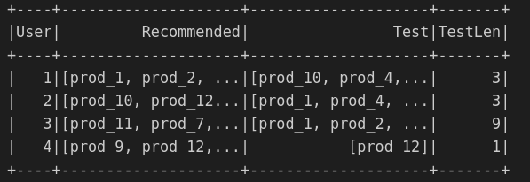
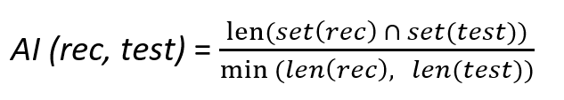
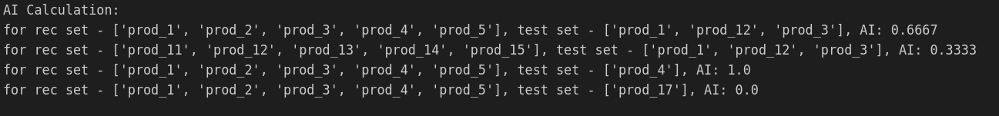
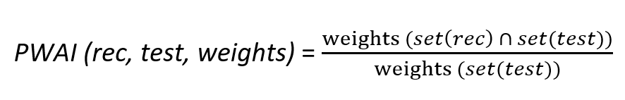
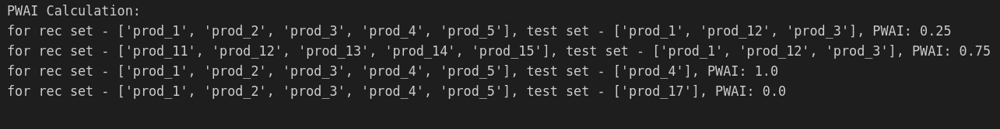
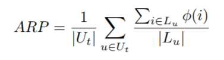
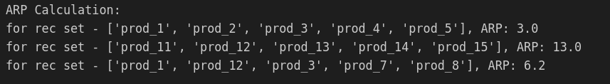
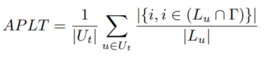
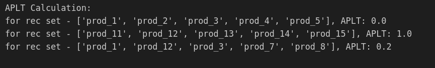

# RecMet

RecMet is a library written in Pyspark and Python, containing different evaluation metrics for recommendation systems. The python functions wrapped in spark udf can be directly used with spark data frames.

## Installation

To install from the github repo 

```bash
git clone https://github.com/rijulizer/RecMet.git
cd RecMet
pip install .
```
Or to use in databricks like environments use -  "git+'https://github.com/rijulizer/RecMet.git'"

## Usage
The metrics can be used on a spark dataframe which looks similar to this-
<p align="center">

</p>
It also consideres a dictionary containing weights of all the products, and a threshold for long-tail items as input

```python
weights ={
    'prod_1':1,
    'prod_2':2,
    'prod_3':3,
    'prod_4':4,
    'prod_5':5,
    'prod_6':6,
    'prod_7':7,
    'prod_8':8,
    'prod_9':9,
    'prod_10':10,
    'prod_11':11,
    'prod_12':12,
    'prod_13':13,
    'prod_14':14,
    'prod_15':15,
    'prod_16':16,
    'prod_17':17,
    'prod_18':18,
}

longtail_thresh = 8
```

```python
from RecMet import recmet

# Instantiate recmet with the weights dictionary containing products as keys 
# and weights as values, and a threshold for the weights to be considered as long-tail

rm = recmet(weights, longtail_thresh)

sdf_rec_metric= sdf_rec.withColumn('AI',rm.AI(sf.col('Recommended'), sf.col('Test')))\
               .withColumn('PWAI',rm.PWAI(sf.col('Recommended'), sf.col('Test')))\
               .withColumn('ARP',rm.ARP(sf.col('Recommended')))\
               .withColumn('APLT',rm.APLT(sf.col('Recommended')))\
               .withColumn('ACLT',rm.ACLT(sf.col('Recommended')))
sdf_rec_metric.show()
```
## Average Intersection (AI)

```python
sdf_rec_metric = sdf_rec.withColumn('AI',rm.AI(sf.col('Recommended'), sf.col('Test')))
```

The Average Intersection (AI) is a generalized version of Average Recall (AR), which is used to measure the accuracy of recommendation. It indicates a measure of common elements between a recommendation set and a test set. In most real-life practical settings, the length of the test set for each user is not constant, and AI factors in that aspect, both the test set and the recommendation set can be of variable length.

<p align="center">

</p>
The numerator counts the common number of elements, and the denominator takes the minmum of the two lengths which makes sure the range of AI is [0-1]

Examples -
<p align="center">

</p>

## Popularity Weighted Average Intersection (PWAI)

```python
sdf_rec_metric = sdf_rec.withColumn('PWAI',rm.PWAI(sf.col('Recommended'), sf.col('Test')))
```

The Popularity Weighted Average Intersection (PWAI) is a special case of AI, where the weight of each product is considered to calculate the accuracy. Often in practical scenarios, there are items that are very popular and there are items that are not so popular, so assigning different weights to them make sense while calculating the accuracy. Weights (key- value pair) can be assigned by the user while instantiating the object.

<p align="center">

</p>
The range of PWAI is [0-1]

Examples -
<p align="center">

</p>

## Average Recommendation Popularity (ARP)

```python
sdf_rec_metric = sdf_rec.withColumn('ARP',rm.ARP(sf.col('Recommended')))
```

This measure calculates the average popularity of recommended items. It can be also modified to calculate the average weight of the recommendations.

<p align="center">

</p>

Where ϕ(i) is the weight of item i in the training
set. Lu is the recommended list of items for user u and |Ut| is the total number of users in the test set.

Examples -
<p align="center">

</p>

## Average percentage of Long Tail Items (APLT)

```python
sdf_rec_metric = sdf_rec.withColumn('ARP',rm.ARP(sf.col('Recommended')))
```
this metric measures the average percentage of long tail items in the recommended lists and it is defined as follows:

<p align="center">

</p>

This measure gives us the average percentage of items in users’ recommendation lists that belong to the long tail set.

Examples - 
<p align="center">

</p>

The metrics ARP, APLT, ACLT are implemented from the paper - 

@inproceedings{abdollahpouri2019managing,
  title={Managing popularity bias in recommender systems with personalized re-ranking},
  author={Abdollahpouri, Himan and Burke, Robin and Mobasher, Bamshad},
  booktitle={The thirty-second international flairs conference},
  year={2019}
}

## Contributing
Pull requests are welcome. For major changes, please open an issue first to discuss what you would like to change.

Please make sure to update tests as appropriate.
